# SpringBoot-JPA-REST-CRUD

<h1>prerequisites</h1>
<ul>
  <li>Java 8</li>
  <li>SpringToolSuite4</li>
  <li>Spring Boot 2.5.5 (with Spring Web MVC, Spring Data JPA)</li>  
  <li>mysql Ver 8.0.26 for Linux on x86_64 (MySQL Community Server - GPL)
</li>
</ul>

 I this example, We are gonna build a String Boot Rest CRUD API qith Maven that use Spring Data JPA to interact with MYSQL database. 

<h1>Create and  setup Spring Boot projet</h1>

File -> New-> Spring starter project

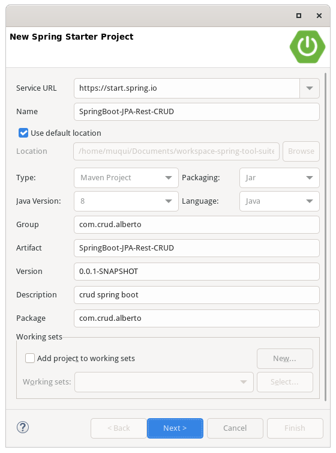

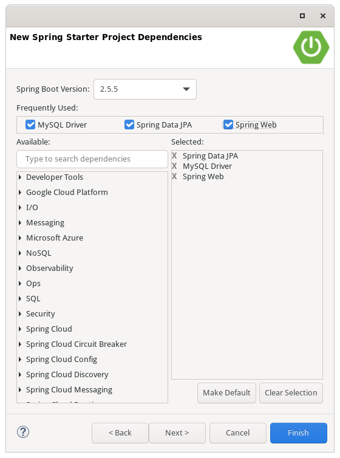

Then open pom.xml and add these depencies.

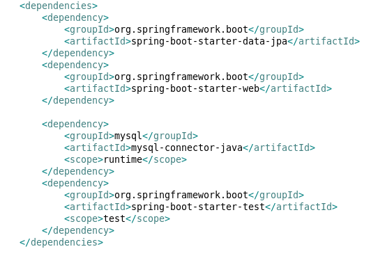
<h1>Configure Spring Datasource, JPA, Hibernate</h1>

Under src/main/resources folder, open application.properties and write these lines

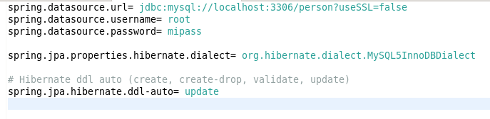
<h1>Define Data Model</h1>

 Our Data Model is Person with four filds: id, name, email, nationality. 

<pre>
    <code>
package com.crud.alberto.model;

import javax.persistence.*;

@Entity
@Table(name = "person")
public class Person {
	@Id
	@GeneratedValue(strategy = GenerationType.AUTO)
	int id;
	@Column(name = "name")
	String name;
	
	@Column(name = "email")
	String email;
	
	@Column(name = "nationality")
	String nationality;
	
	public Person() {
		
	}

	public int getId() {
		return id;
	}
	
	
	public Person(String name, String email, String nationality) {
		super();
		this.name = name;
		this.email = email;
		this.nationality = nationality;
	}

	public void setId(int id) {
		this.id = id;
	}

	public String getName() {
		return name;
	}

	public void setName(String name) {
		this.name = name;
	}

	public String getEmail() {
		return email;
	}

	public void setEmail(String email) {
		this.email = email;
	}

	public String getNationality() {
		return nationality;
	}

	public void setNationality(String nationality) {
		this.nationality = nationality;
	}

	@Override
	public String toString() {
		return "Person [id=" + id + ", name=" + name + ", email=" + email + ", nationality=" + nationality + "]";
	}
	
}

    </code>
</pre>
<h1>Create Repostitory Interface</h1>

We create a repository to interact with Person from database.

In com.crud.alberto.repository package create PersonRepository interface that extends  JpaRepository. 

<pre>
 <code>
    package com.crud.alberto.repository;

import com.crud.alberto.model.Person;
import org.springframework.stereotype.Repository;
import org.springframework.data.jpa.repository.JpaRepository;

@Repository
  public interface PersonRepository  extends JpaRepository<Person, Integer>{
}

</code>
</pre>

Now we can use JpaRepository's mehods: save(), fondOne(), findById(), findAll(), count(), delete(), deleteById()... without implementing these methods. 

<h1>Create Spring Rest APIs Controller</h1>

We create a controller that provides APIs fro creating, retrieving, uddating, deleting and finding people.

 PersonController.class

<pre>
    <code>
        package com.crud.alberto.controller;
import java.util.ArrayList;
import java.util.List;
import java.util.Optional;
import org.springframework.beans.factory.annotation.Autowired;
import org.springframework.http.HttpStatus;
import org.springframework.http.ResponseEntity;
import org.springframework.web.bind.annotation.CrossOrigin;
import org.springframework.web.bind.annotation.DeleteMapping;
import org.springframework.web.bind.annotation.GetMapping;
import org.springframework.web.bind.annotation.PathVariable;
import org.springframework.web.bind.annotation.PostMapping;
import org.springframework.web.bind.annotation.PutMapping;
import org.springframework.web.bind.annotation.RequestBody;
import org.springframework.web.bind.annotation.RequestMapping;
import org.springframework.web.bind.annotation.RequestParam;
import org.springframework.web.bind.annotation.RestController;
import com.crud.alberto.repository.*;
import com.crud.alberto.model.*;

@CrossOrigin(origins = "http://localhost:8081")
@RestController
@RequestMapping("/api")
public class PersonController {
	@Autowired
	  PersonRepository personRepository;
	
	 @GetMapping("/people")
	  public ResponseEntity<List<Person>> getAllTutorials() {
	    try {
	      List<Person> persons = new ArrayList<Person>();	 
	      personRepository.findAll().forEach(persons::add);
	      return new ResponseEntity<>(persons, HttpStatus.OK);
	    } catch (Exception e) {
	      return new ResponseEntity<>(null, HttpStatus.INTERNAL_SERVER_ERROR);
	    }
	 }
	 
	 @GetMapping("/person/{id}")
	  public ResponseEntity<Person> getTutorialById(@PathVariable("id") Integer id) {
	    Optional<Person> tutorialData = personRepository.findById(id);

	    if (tutorialData.isPresent()) {
	      return new ResponseEntity<>(tutorialData.get(), HttpStatus.OK);
	    } else {
	      return new ResponseEntity<>(HttpStatus.NOT_FOUND);
	    }
	  }
	 
	 @PostMapping("/person")
	  public ResponseEntity<Person> createTutorial(@RequestBody Person person) {
	    try {
	      Person p = personRepository
	          .save(new  Person(person.getName(), person.getEmail(), person.getNationality()));
	      return new ResponseEntity<>(p, HttpStatus.CREATED);
	    } catch (Exception e) {
	      return new ResponseEntity<>(null, HttpStatus.INTERNAL_SERVER_ERROR);
	    }
	 }
	 
	 @PutMapping("/person/{id}")
	  public ResponseEntity<Person> updateTutorial(@PathVariable("id") Integer id, @RequestBody Person tutorial) {
	    Optional<Person> tutorialData = personRepository.findById(id);

	    if (tutorialData.isPresent()) {
	      Person _tutorial = tutorialData.get();
	      _tutorial.setName(tutorial.getName());
	      _tutorial.setEmail(tutorial.getEmail());
	      _tutorial.setNationality(tutorial.getNationality());
	      return new ResponseEntity<>(personRepository.save(_tutorial), HttpStatus.OK);
	    } else {
	      return new ResponseEntity<>(HttpStatus.NOT_FOUND);
	    }
	  }
	 
	 @DeleteMapping("/person/{id}")
	  public ResponseEntity<HttpStatus> deleteTutorial(@PathVariable("id") Integer id) {
	    try {
	      personRepository.deleteById(id);
	      return new ResponseEntity<>(HttpStatus.NO_CONTENT);
	    } catch (Exception e) {
	      return new ResponseEntity<>(HttpStatus.INTERNAL_SERVER_ERROR);
	    }
	  }
	 
	 @DeleteMapping("/people")
	  public ResponseEntity<HttpStatus> deleteAllTutorials() {
	    try {
	      personRepository.deleteAll();
	      return new ResponseEntity<>(HttpStatus.NO_CONTENT);
	    } catch (Exception e) {
	      return new ResponseEntity<>(HttpStatus.INTERNAL_SERVER_ERROR);
	    }

	  }
}
    </code>

</pre>

<h1>Run and test</h1>

Run Spring Boot application.

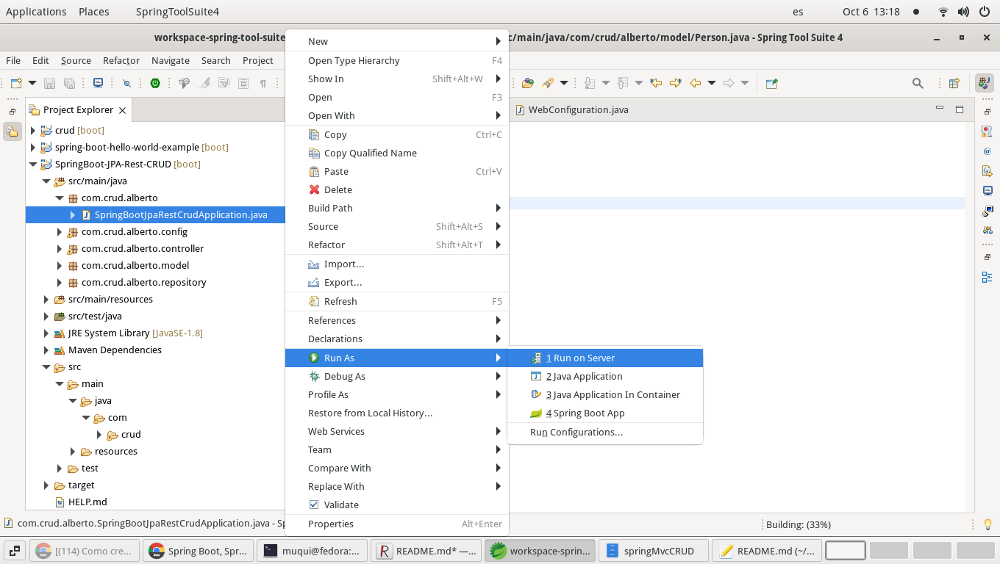

Create some person

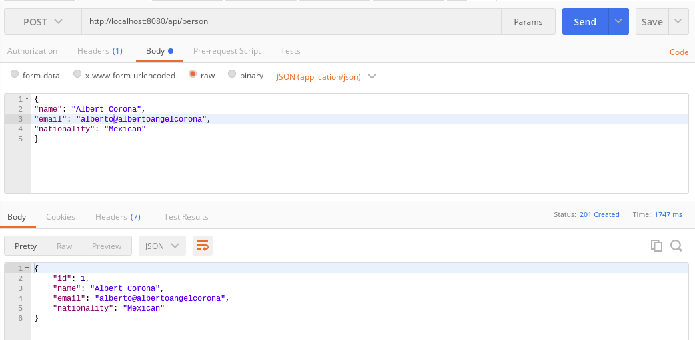

We check table person.

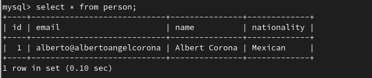

Update some person.

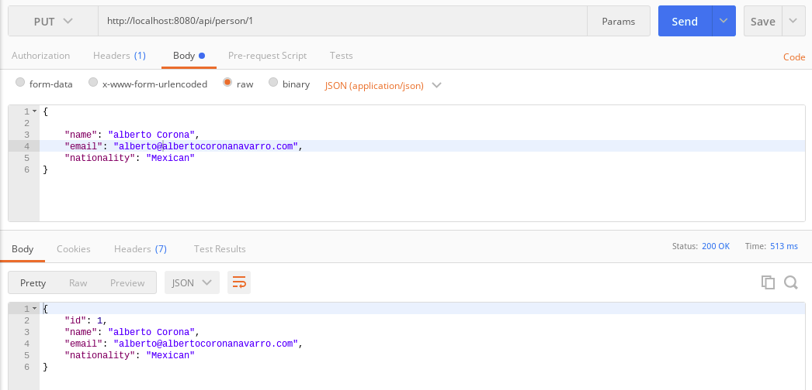

Get all People

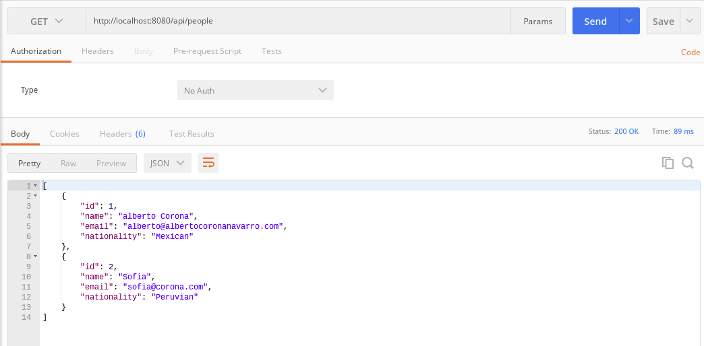

Get person by id

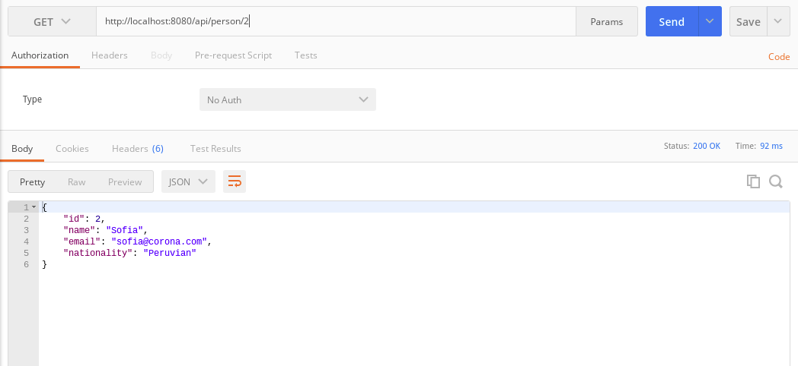

Delete person by id

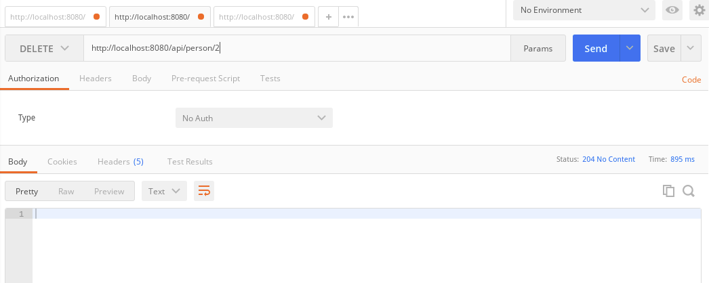

Delete all people

